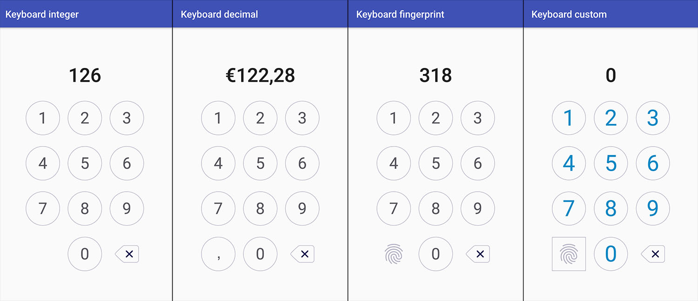

# Number Keyboard

Android library that provides a number keyboard view.



## Usage

Use `NumberKeyboard` view in your layout:

```xml
<com.numberkeyboard.NumberKeyboard
    xmlns:android="http://schemas.android.com/apk/res/android"
    xmlns:keyboard="http://schemas.android.com/apk/res-auto"
    ...
    keyboard:numberkeyboard_keyboardType="integer"
    ... />
```

#### Attributes

- `keyboard:numberkeyboard_keyboardType="[integer|decimal|fingerprint|custom]"` (required): defines the type of keyboard.
  - `integer`: numbers and backspace keys.
  - `decimal`: numbers, comma and backspace keys.
  - `fingerprint`: numbers, fingerprint and backspace keys.
  - `custom`: numbers and defined auxiliary keys.
- `keyboard:numberkeyboard_keyWidth="[dimension]"` (default: `match_parent`): key width (`wrap_content` not allowed).
- `keyboard:numberkeyboard_keyHeight="[dimension]"` (default: `match_parent`): key height (`wrap_content` not allowed).
- `keyboard:numberkeyboard_keyPadding="[dimension]"` (default: `16dp`): key padding.
- `keyboard:numberkeyboard_numberKeyBackground="[reference]"` (default: circle): number keys background drawable.
- `keyboard:numberkeyboard_numberKeyTextColor="[reference]"` (default: dark blue): number keys text color.
- `keyboard:numberkeyboard_leftAuxBtnIcon="[reference]"` (default: none): if `keyboardType="custom"`, icon shown in left auxiliary button.
- `keyboard:numberkeyboard_leftAuxBtnBackground="[reference]"` (default: none): if `keyboardType="custom"`, left auxiliary button background.
- `keyboard:numberkeyboard_rightAuxBtnIcon="[reference]"` (default: none): if `keyboardType="custom"`, icon shown in right auxiliary button.
- `keyboard:numberkeyboard_rightAuxBtnBackground="[reference]"` (default: none): if `keyboardType="custom"`, right auxiliary button background.

#### Methods

- `hideLeftAuxButton()`: hides left auxiliary button.
- `showLeftAuxButton()`: shows left auxiliary button.
- `hideRightAuxButton()`: hides right auxiliary button.
- `showRightAuxButton()`: shows right auxiliary button.
- `setKeyWidth()`: sets key width in px.
- `setKeyHeight()`: sets key height in px.
- `setKeyPadding()`: sets key padding in px.
- `setNumberKeyBackground()`: sets number keys background.
- `setNumberKeyTextColor()`: sets number keys text color.
- `setNumberKeyTypeface()`: sets number keys text typeface.
- `setLeftAuxButtonIcon()`: sets left auxiliary button icon.
- `setRightAuxButtonIcon()`: sets right auxiliary button icon.
- `setLeftAuxButtonBackground()`: sets left auxiliary button background.
- `setRightAuxButtonBackground()`: sets right auxiliary button background.

#### Callback

To listen to keyboard events, you have to use `NumberKeyboardListener`:

- `onNumberClicked()`: invoked when a number key is clicked.
- `onLeftAuxButtonClicked()`: invoked when the left auxiliary button is clicked.
- `onRightAuxButtonClicked()`: invoked when the right auxiliary button is clicked.

```java
numberKeyboard.setListener(new NumberKeyboardListener() {
     @Override
     public void onNumberClicked(int number) {...}

     @Override
     public void onLeftAuxButtonClicked() {...}

     @Override
     public void onRightAuxButtonClicked() {...}
});
```

Take a look at the [sample app] to see the library working.
